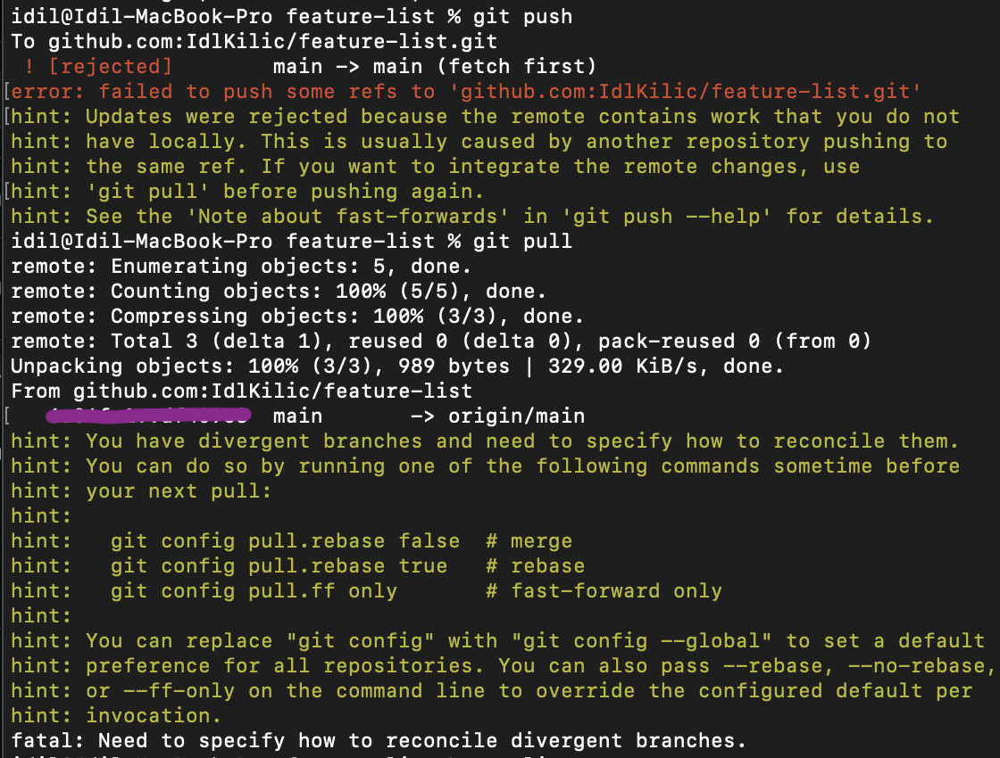
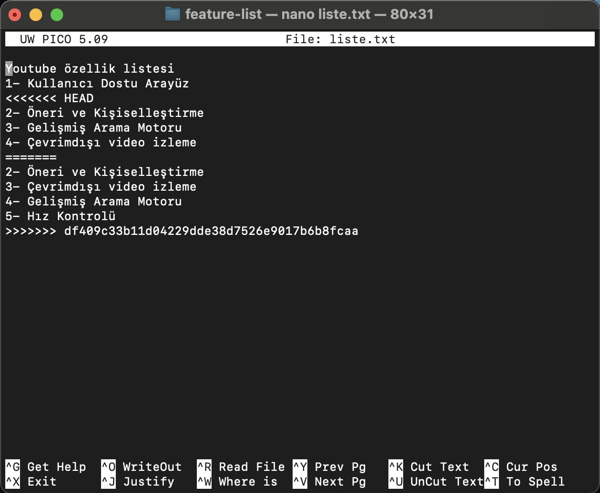

# feature-list

** Terminalden SSH anahtarı oluşturup repository urlsi ile giriş

YM dosyası oluşturulup --> cd YM
git clone ile Repo yerel bilgisayara klonlandı
cd feature-list ve 5. özellik ekleme
git add, commit islemleri ve git push komutları
Repodan 3. ve 5. özelliğin yerini değiştirme 
git add, commit islemleri ve git push komutları

#Hata ile karşılaşma

git pull komutu --> git config pull.rebase false  # merge
git pull komutu tekrar 

git add, commit islemleri ve git push komutları
3. özelliğin silinmesi
git add, commit islemleri ve git push komutları

#4 özellikli liste.txt ödevi tamamlandı
